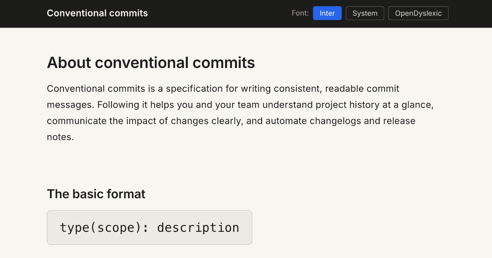

# Conventional commits

A scannable reference guide for conventional commits. The [official spec](https://www.conventionalcommits.org/en/v1.0.0/) is thorough but hard to read mid-commit. This strips it back to what you need.

## Site

**[karlhorning.dev/conventional-commits](https://www.karlhorning.dev/conventional-commits/)**

The site includes font options (Inter, system, and OpenDyslexic) and a working dark mode. Built with HTML, CSS, and JavaScript. No framework, no build step.

Tested with WAVE and VoiceOver on macOS. Meets WCAG 2.1 AAA contrast. VoiceOver has a lower market share than NVDA or JAWS, so if you find issues with another screen reader, please [open an issue](https://github.com/Karl-Horning/conventional-commits/issues).

## Markdown guide

A plain markdown version is available in [GUIDE.md](./GUIDE.md) if you prefer to keep a local copy. Note that the site and the guide are maintained separately. If you spot them out of sync, please [open an issue](https://github.com/Karl-Horning/conventional-commits/issues).

## Contributing

Spotted a mistake or have a suggestion? [Open an issue](https://github.com/Karl-Horning/conventional-commits/issues) or submit a pull request. Both are welcome.

## License

Released under the [MIT License](./LICENSE) by [Karl Horning](https://github.com/Karl-Horning).
